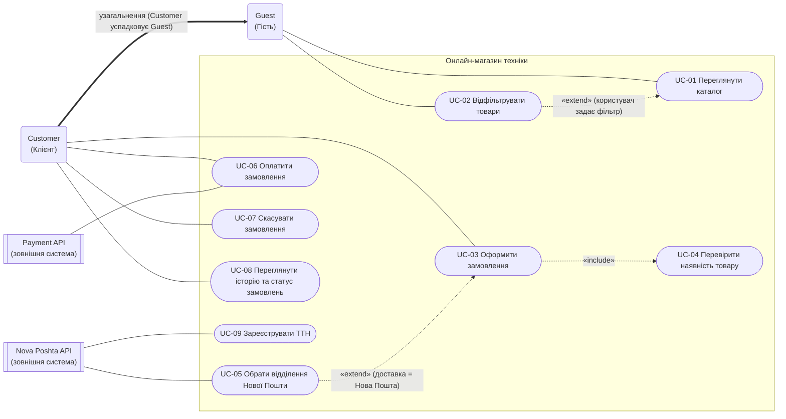

## 1 - будування use case діаграми
**Промт**
> Побудуй use case діаграму спираючись на мій spec.md (Use Case Diagram (PlantUML / Mermaid) з ≥2 типами акторів, include/extend, узагальненням.) зроби в мермейд

**Відповідь від AI**
